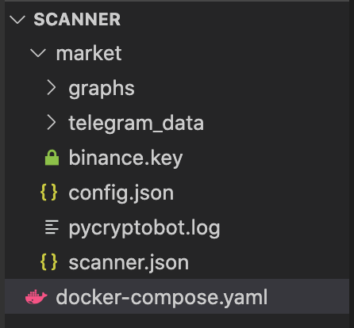
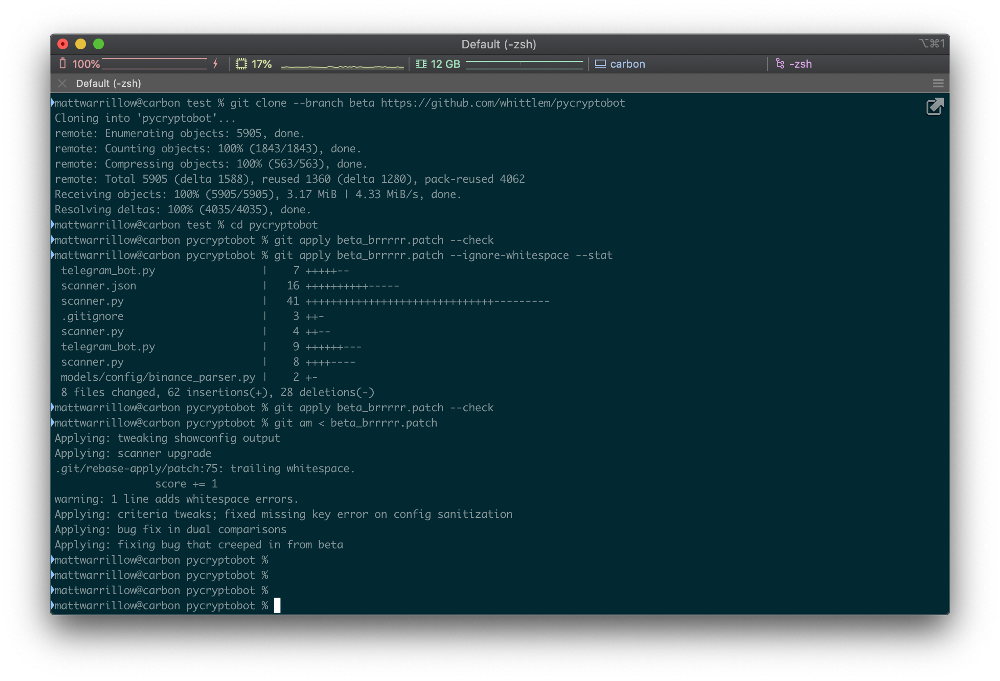

# PyCryptoBot and Docker

PyCryptoBot can run in two modes Botfight and Telegram Control mode. For Botfight mode setup see [docker-compose option 2](https://github.com/whittlem/pycryptobot#docker-compose-option-2) in the main README file.
This guide is going to concentrate on the Telegram Control and Scanner mode, it will focus on the docker configuration and supplying some basic bot config but will not be going in depth to the bot configuration file in this guide.

## Prerequisites

The following software should be installed before starting this guide.

-   Docker
-   docker-compose
-   GIT
-   Visual Studio Code (Optional you just need a text editor)
-   Docker hub account (Optional only for cross compiling builds)

## Contents

- [PyCryptoBot and Docker](#pycryptobot-and-docker)
  - [Prerequisites](#prerequisites)
  - [Contents](#contents)
- [Basic Configurations (Latest release)](#basic-configurations-latest-release)
  - [Build a Folder Structure](#build-a-folder-structure)
  - [Populate your docker-compose file](#populate-your-docker-compose-file)
- [Building a container with the Beta Branch](#building-a-container-with-the-beta-branch)
  - [Clone the beta branch](#clone-the-beta-branch)
  - [Patch as required](#patch-as-required)
  - [Build a local copy of your beta container](#build-a-local-copy-of-your-beta-container)
  - [Run the beta container](#run-the-beta-container)
- [One Step Build and Deploy (Advanced)](#one-step-build-and-deploy-advanced)
  - [Pull](#pull)
  - [Configure](#configure)
  - [Deploy](#deploy)
  - [Update Container](#update-container)
- [Cross Compiling for ARM](#cross-compiling-for-arm)
  - [Setup Docker Buildx](#setup-docker-buildx)
  - [Tell buildx to use your new image builder](#tell-buildx-to-use-your-new-image-builder)
  - [Run the beta container](#run-the-beta-container-1)
- [Appendix](#appendix)
  - [Useful Docker commands](#useful-docker-commands)
  - [My Config files](#my-config-files)
- [References](#references)

# Basic Configurations (Latest release)

## Build a Folder Structure

Build a basic folder structure containing the required configuration files as detailed below.
I recommend following [this guide](https://playful-curio-e62.notion.site/Scanning-the-market-fd9b58b059dd4cf8addb167af7f36311) for information on how to setup the config.json and scanner.json files. I will post mine at the end of the guide but will highly recommend creating your own instead of copy pasting configuration.



## Populate your docker-compose file

When creating the docker-compose file you will need to ensure that the volume mappings are setup correctly to the files that you have added to the folder structure above.
When configuring [_volumes:_](https://docs.docker.com/compose/compose-file/compose-file-v3/#volumes) in the compose file the left hand side of the : is the local folder and the right hand side is the location in the "app" that it will map the files to inside of the container.
Edit the left hand side as appropriate (it should work out the box if you have the folder structure above.)

The other important note is the [_entrypoint:_](https://docs.docker.com/compose/compose-file/compose-file-v3/#entrypoint) property this overrides the default entrypoint in the dockerfile with the entrypoint specified in the docker-compose file. In the example below I am calling the [telegram_bot.py](https://github.com/whittlem/pycryptobot/blob/main/telegram_bot.py) script instead of the default [pycryptobot.py](https://github.com/whittlem/pycryptobot/blob/main/pycryptobot.py) script.

docker-compose.yml

```yaml
version: "3.9"

services:
    pycryptobot:
        image: ghcr.io/whittlem/pycryptobot/pycryptobot:latest
        container_name: pycryptobot
        volumes:
            - ./market/binance.key:/app/keys/binance.key:ro
            - ./market/config.json:/app/config.json
            - ./market/pycryptobot.log:/app/pycryptobot.log
            - ./market/scanner.json:/app/scanner.json
            - ./market:/app/telegram_data
            - ./market/graphs:/app/graphs
            - /etc/timezone:/etc/timezone:ro
            - /etc/localtime:/etc/localtime:ro
        environment:
            - PYTHONUNBUFFERED=1
        entrypoint: ["python3", "-u", "telegram_bot.py"]
        restart: always
```

To start the container run the following command from inside the folder that contains the docker-compose.yml file

`docker-compose up -d`

Your scanner is now alive and ready to play.

# Building a container with the Beta Branch

## Clone the beta branch

From a terminal screen clone the beta branch by running the following command, this will download the latest beta branch into a folder called pycryptobot.

If you wish to use a different branch then change the branch name from beta to your chosen branch.

`git clone --branch beta https://github.com/whittlem/pycryptobot`

## Patch as required

At this step you can go in and update or patch any of the files in the pycryptobot folder, do not add your personal config or keys to this folder as you do not want these to be baked into the image.

If you have a git patch file this is where you can apply it using this command replacing the patch file name as needed.



```
test %
test % git clone --branch beta https://github.com/whittlem/pycryptobot
Cloning into 'pycryptobot'...
remote: Enumerating objects: 5905, done.
remote: Counting objects: 100% (1843/1843), done.
remote: Compressing objects: 100% (563/563), done.
remote: Total 5905 (delta 1588), reused 1360 (delta 1280), pack-reused 4062
Receiving objects: 100% (5905/5905), 3.17 MiB | 6.37 MiB/s, done.
Resolving deltas: 100% (4035/4035), done.

test % cd pycryptobot

pycryptobot % git apply beta_brrrrr.patch --check

pycryptobot % git apply beta_brrrrr.patch --ignore-whitespace --stat
 self.telegram_bot.py                 |    7 +++++--
 scanner.json                    |   16 ++++++++++-----
 scanner.py                      |   41 ++++++++++++++++++++++++++++++---------
 .gitignore                      |    3 ++-
 scanner.py                      |    4 ++--
 self.telegram_bot.py                 |    9 ++++++---
 scanner.py                      |    8 ++++----
 models/config/binance_parser.py |    2 +-
 8 files changed, 62 insertions(+), 28 deletions(-)

pycryptobot % git apply beta_brrrrr.patch --check

pycryptobot % git am < beta_brrrrr.patch
Applying: tweaking showconfig output
Applying: scanner upgrade
.git/rebase-apply/patch:75: trailing whitespace.
                score += 1
warning: 1 line adds whitespace errors.
Applying: criteria tweaks; fixed missing key error on config sanitization
Applying: bug fix in dual comparisons
Applying: fixing bug that creeped in from beta

pycryptobot %
```

## Build a local copy of your beta container

Build the docker container with all of your changes by running this command from within the pycryptobot folder. This will compile all of the required files into a docker image that can be ran as a container.

In the example below it assumes you are going to run docker-compose on the same device you ran the build on. Also note that it is not advisable to run the build on a low powered device like a raspberry pi as this can take up to 7 hours for a complete build. See the Compile for ARM section below on how do build an image for a Raspberry Pi.

`docker build --file Dockerfile . --tag pycryptobot`

If you wish to run the docker container on a different device it is recommended to push the image to docker hub and download it from there on the other device. To do this change the "tag" from pycryptobot to dockerhub_username/pycryptobot see the following example.

`docker build --file Dockerfile . --tag mattwa/pycryptobot:beta`

You can then push the image to docker hub if you wish, this will push the image to your docker hub self.account.

`docker push mattwa/pycryptobot:beta`

## Run the beta container

Follow the steps above in the [Basic Configurations (Latest release)](#basic-configurations-latest-release) section but modify the [_image:_](https://docs.docker.com/compose/compose-file/compose-file-v3/#image) section of the docker-compose file to have the name that you tagged the image in the build step above.

docker-compose.yml

```yaml
version: "3.9"

services:
    pycryptobot:
        image: pycryptobot
        container_name: pycryptobot
        volumes:
            - ./market/binance.key:/app/keys/binance.key:ro
            - ./market/config.json:/app/config.json
            - ./market/pycryptobot.log:/app/pycryptobot.log
            - ./market/scanner.json:/app/scanner.json
            - ./market:/app/telegram_data
            - ./market/graphs:/app/graphs
            - /etc/timezone:/etc/timezone:ro
            - /etc/localtime:/etc/localtime:ro
        environment:
            - PYTHONUNBUFFERED=1
        entrypoint: ["python3", "-u", "telegram_bot.py"]
        restart: always
```

To start the container run the following command from inside the folder that contains the docker-compose.yml file

`docker-compose up -d`

Your scanner is now alive and ready to play.

# One Step Build and Deploy (Advanced)

This is a one step build and deploy on the same device that you have cloned the repository on.  This is good for those who are testing new builds or want to be on the latest beta and want the ability to update in one step.

Note that this comes with some dangers as we will be "baking" building in our own personal configuration into the docker container. This is not normal docker procedure as it comes with the risk that if the container is pushed to a public repository then you may expose your APIkeys to the world.

This risk is mitigated by not tagging the image with a name eg calling it pycryptobot only rather than docker_username/pycryptobot and secondly we don't run the docker push command.

## Pull

Pull the latest version of your preferred branch.

`git clone --branch beta https://github.com/whittlem/pycryptobot`

Make any changes and [Patch as required](#patch-as-required)

## Configure

Update the configurations in the pycryptobot folder, you can still folder map them using the volumes if you wish to keep your configuration separate to the pycryptobot git folder.

Update the docker-compose.yml file inside of the pycryptobot folder, update your volume mappings as required and add this line to the services section as shown below.

`entrypoint: ["python3", "-u", "telegram_bot.py"]`

Adding this line in will override the default entrypoint and start the telegram bot, omitting this line will use the default entrypoint and will only trade the coin specified in the config.json file.

## Deploy

Run this command from within the pycryptobot git folder and it will build the latest version of the container from the files you have locally on your device and then start the container immediately.

`docker-compose up -d --build`

```yaml
version: "3.9"

services:
    pycryptobot:
        build:
          context: .
        container_name: pycryptobot
        volumes:
            - ./market/BTCEUR/coinbase.key:/app/coinbase.key.json
            - ./market/BTCEUR/config.json:/app/config.json
            - ./market/BTCEUR/pycryptobot.log:/app/pycryptobot.log
            - ./market/BTCEUR/graphs:/app/graphs
            - ./market:/app/telegram_data
            - /etc/timezone:/etc/timezone:ro
            - /etc/localtime:/etc/localtime:ro
        environment:
            - PYTHONUNBUFFERED=1
        entrypoint: ["python3", "-u", "telegram_bot.py"]
        deploy:
          restart_policy:
            condition: on-failure
```

## Update Container

To update to the latest version of your current branch perform the following steps.

Pull the latest files from github.

`git pull`

Rebuild and run your container.

`docker-compose up -d --build`


# Cross Compiling for ARM

_You might need to fuzz with qemu stuff_

Complete the [Building a container with the Beta Branch](#building-a-container-with-the-beta-branch) section to [Patch as required](#patch-as-required) and then pickup the guide below with the build process.

## Setup Docker Buildx

First we need to build the create the build instance by running the following command. I have named this raspberrypi but you can name this builder anything you wish. I have also added the basic ARM versions for the Raspberry pi in the below command. You may add in any additional architectures you may require.

You should only need to perform this step once.

`docker buildx create --name raspberrypi --platform linux/armhf,linux/aarch64,linux/amd64`

## Tell buildx to use your new image builder

This command selects your image builder instance by name and enabled it.

`docker buildx use raspberrypi`

The final step is to run the build command this will build for all architecture's specified in the command line by the --platform flag. Once the images have built successfully the buildx builder will push the images to docker hub with the tags specified.

NOTE that the arm64 build (aarch64) takes a very long time as it needs to compile dependencies for the Raspberry Pi 4

`docker buildx build --platform linux/armhf,linux/aarch64,linux/amd64 --tag mattwa/pycryptobot:beta --push --file Dockerfile .`

## Run the beta container

Follow the steps above in the [Basic Configurations (Latest release)](#basic-configurations-latest-release) section but modify the [_image:_](https://docs.docker.com/compose/compose-file/compose-file-v3/#image) section of the docker-compose file to have the name that you tagged the image in the build step above.

docker-compose.yml

```yaml
version: "3.9"

services:
    pycryptobot:
        image: mattwa/pycryptobot:beta
        container_name: pycryptobot
        volumes:
            - ./market/binance.key:/app/keys/binance.key:ro
            - ./market/config.json:/app/config.json
            - ./market/pycryptobot.log:/app/pycryptobot.log
            - ./market/scanner.json:/app/scanner.json
            - ./market:/app/telegram_data
            - ./market/graphs:/app/graphs
            - /etc/timezone:/etc/timezone:ro
            - /etc/localtime:/etc/localtime:ro
        environment:
            - PYTHONUNBUFFERED=1
        entrypoint: ["python3", "-u", "telegram_bot.py"]
        restart: always
```

To start the container run the following command from inside the folder that contains the docker-compose.yml file

`docker-compose up -d`

Your scanner is now alive and ready to play.

# Appendix

## Useful Docker commands

Run all containers in the docker-compose.yml file

`docker-compose up -d`

Builds image and deploys it in one step.

`docker-compose up -d --build`

Force recreation of the container even if the image has not updated

`docker-compose up -d --force-recreate`

Pull an updated version of the image from the registry

`docker-compose pull`

Stop and Destroy all containers in the docker-compose.yml file

`docker-compose down`

View all logs for all containers in docker-compose.yml (Follow and Tail _Ctrl + C_ to un-follow log. )

`docker-compose logs -f -t`

Show all running containers

`docker ps`

Follow logs of specific container

`docker container logs container_name --follow`

"Exec" into a container This will give you a # prompt for the container that you can mess around inside of it for debuggings. (Don't change any files inside the container as the changes will get lost when the container updates. )

`docker exec -it container_name bash`

## My Config files

I recommend not blindly copying these and testing out your own versions of these files as I am still tuning my bot to suit my needs.

scanner.json

```json
{
    "binance": {
        "quote_currency": ["BUSD"]
    }
}
```

config.json

```json
{
    "binance": {
        "api_url": "https://api.binance.com",
        "config": {
            "base_currency": "BTC",
            "quote_currency": "BUSD",
            "telegrambotcontrol": 1,
            "live": 1,
            "disablebullonly": 1,
            "sellupperpcnt": 5,
            "disablebuyelderray": 1,
            "sellatloss": 1,
            "websocket": 1,
            "disablelog": 0,
            "autorestart": 1,
            "enableinsufficientfundslogging": 1,
            "logbuysellinjson": 1,
            "graphs": 1,
            "filelog": 1,
            "logfile": "pycryptobot.log",
            "recvwindow": 20000,
            "fileloglevel": "DEBUG",
            "consolelog": 1,
            "consoleloglevel": "DEBUG"
        },
        "api_key_file": "/app/keys/binance.key"
    },
    "telegram": {
        "token": <Secret Code>,
        "client_id": <Secret Code>,
        "user_id": <Secret Code>,
        "datafolder": "/app/telegram_data"
    },
    "scanner": {
        "atr72_pcnt": 3.0,
        "exitaftersell": 1,
        "enableleverage": 0,
        "maxbotcount": 10,
        "autoscandelay": 1,
        "enable_buy_next": 1
    }
}

```

# References

- [Scanning the market](https://playful-curio-e62.notion.site/Scanning-the-market-fd9b58b059dd4cf8addb167af7f36311)
- [Compose file version 3 reference](https://docs.docker.com/compose/compose-file/compose-file-v3/)
- [How I built ARM based Docker Images for Raspberry Pi using buildx CLI Plugin on Docker Desktop?](https://collabnix.com/building-arm-based-docker-images-on-docker-desktop-made-possible-using-buildx/)